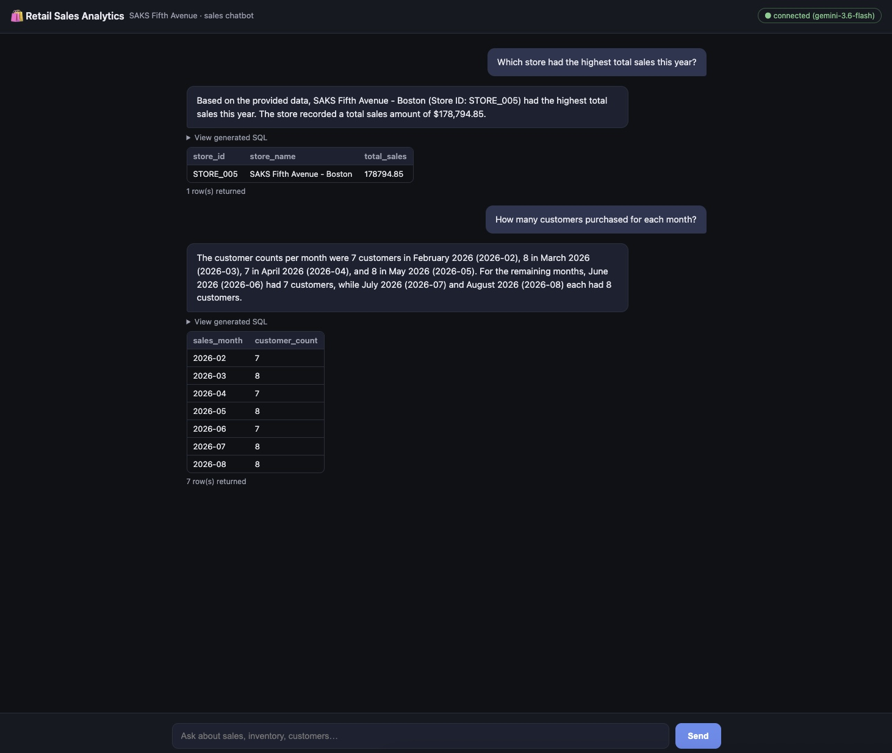
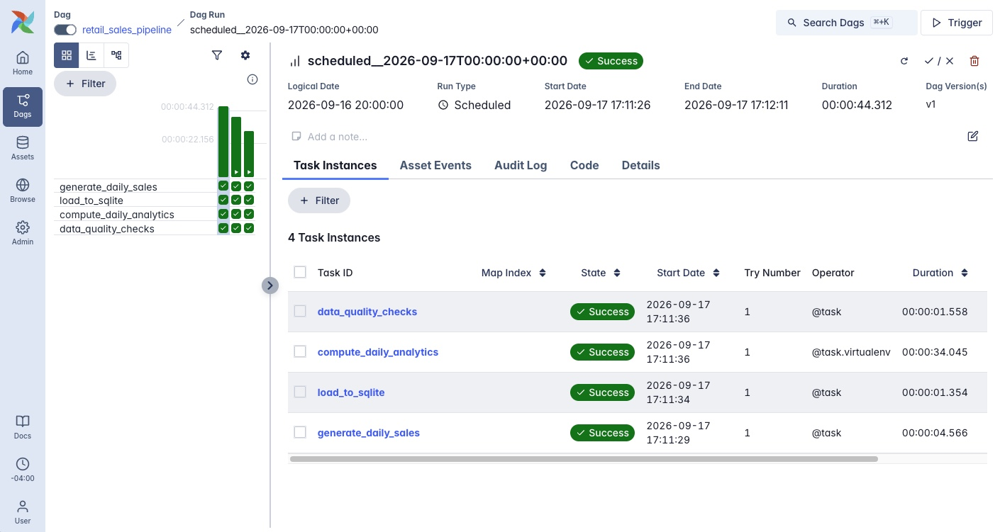

## Retail Sales Analytics Chatbot

A natural-language analytics chatbot for a fictional SAKS Fifth Avenue retail dataset. Ask
plain-English questions about sales, inventory, and customers; a FastAPI backend turns the
question into SQL with Gemini, runs it against a local SQLite database, and returns both the
data and a plain-English summary. The same chatbot is available as a web page and as a mobile
app.

### Architecture

- **Backend** (`app.py`) — FastAPI + SQLite + Google Gemini (`google-genai`). Owns the one-time
  historical seed, the NL→SQL pipeline, and also serves the frontend as static files.
- **Pipeline** (`airflow/`) — a standalone Apache Airflow DAG (`retail_sales_pipeline`) that owns
  the *ongoing* data: it generates each day's new transactions, loads them into the same SQLite
  database, computes a daily revenue/top-product summary, and runs data quality checks. See
  [Data pipeline](#data-pipeline-airflow) below.
- **Frontend** (`frontend/index.html`) — a single self-contained HTML/JS chat page. No build
  step; it's served directly by the backend, or can be opened as a local file.
- **Mobile** (`mobile/`) — an Expo Router (SDK 54) app that displays the same chat page inside
  a native WebView, for testing on a phone via Expo Go.

### Data model

`app.py` seeds a SQLite database (`retail_sales_analytics.db`) with five tables on first run;
Airflow adds a sixth, derived one. The product/store/customer catalog and row generator live in
`shared/retail_data.py`, a single source of truth used by both `app.py` and the DAG.

| Table | Columns | Notes |
|---|---|---|
| `retail_sales_products` | `product_id`, `product_name`, `category`, `brand`, `unit_price` | Shoes/Bags/Watches from brands like Nike, Gucci, Rolex |
| `retail_sales_stores` | `store_id`, `store_name`, `city`, `state`, `zip_code` | 5 SAKS Fifth Avenue store locations |
| `retail_sales_customers` | `customer_id`, `customer_name`, `email`, `loyalty_status`, `lifetime_value` | Loyalty tiers: Silver/Gold/Platinum |
| `retail_sales_sales_data` | `transaction_id`, `store_id`, `product_id`, `customer_id`, `quantity`, `unit_price`, `total_sales`, `sales_date`, `sales_month`, `sales_year` | Seeded with 6 months of history (fixed seed); Airflow appends new rows for each day it runs |
| `retail_sales_inventory` | `inventory_id`, `store_id`, `product_id`, `quantity_on_hand`, `reorder_level` | Stock levels per store/product |
| `retail_sales_daily_summary` | `sales_date`, `store_id`, `total_revenue`, `top_product_id`, `computed_at` | Built by Airflow's `compute_daily_analytics` task, PK `(sales_date, store_id)` |

`sales_date` is `YYYY-MM-DD`, `sales_month` is `YYYY-MM` — both exist so the chatbot can resolve
relative time questions ("last month", "this year") without doing date math in SQL.

### Data pipeline (Airflow)

`airflow/` runs a standalone Apache Airflow instance (`airflow standalone` — no Docker) with one
DAG, `retail_sales_pipeline`, scheduled daily:

1. **`generate_daily_sales`** — simulate that day's new transactions.
2. **`load_to_sqlite`** — insert them into `retail_sales_analytics.db`.
3. **`compute_daily_analytics`** — pandas aggregation into `retail_sales_daily_summary` (revenue
   by store/day, top product). Runs via `PythonVirtualenvOperator`, so pandas is installed into
   its own throwaway venv per run rather than into Airflow's base environment.
4. **`data_quality_checks`** — fails the run if any newly loaded row references an unknown
   store/product/customer, or `total_sales != quantity * unit_price`.

Setup and more detail: [`airflow/README.md`](airflow/README.md).

### The chatbot (backend)

`POST /chat` runs a three-step pipeline:

1. **NL → SQL** — the question, today's date, and the schema above are sent to Gemini, which
   returns a single read-only `SELECT` statement.
2. **Execute** — the query is checked against a small guard (must start with `SELECT`, no
   `INSERT`/`UPDATE`/`DELETE`/`DROP`/`ALTER`/`ATTACH`/`PRAGMA`/`;`) and run against SQLite.
3. **Summarize** — the resulting rows are sent back to Gemini to produce a 2-3 sentence,
   plain-English answer.

The response includes the original question, the generated SQL, the raw rows, and the summary,
so the UI can show "View generated SQL" alongside the answer.

Other endpoints: `GET /health` (backend/DB/LLM status), `GET /tables`, `GET /schema/{table_name}`.

### Frontend

A dark-themed, single-page chat UI (`frontend/index.html`) with:
- A message thread (your questions + the chatbot's summaries)
- An expandable "View generated SQL" block per answer
- A results table for the returned rows
- Starter suggestion chips for common questions

It's mounted directly on the backend (`app.mount("/", StaticFiles(...))`), so opening
`http://localhost:8000/` — from a browser on the same machine, or another device on the same
network — loads it with no separate server needed. It also still works opened as a plain local
file, falling back to `http://localhost:8000` for API calls in that case.

### Mobile app

`mobile/` is an Expo Router project (SDK 54, matching the Apple/Google app-store build of Expo
Go) with `react-native-webview` installed. Its Home tab (`mobile/app/(tabs)/index.tsx`) renders
the same chat page inside a `WebView`, pointed at wherever the backend is reachable — the Mac's
LAN IP for same-Wi-Fi testing, or an `ngrok` HTTPS tunnel when testing over a network that blocks
direct device-to-device connections or when iOS's App Transport Security blocks a plain `http://`
address in the WebView.

To try it: `cd mobile && npx expo start`, then scan the QR code with the Camera app (iOS) or
Expo Go (Android).
